# PennyTrail - Features

PennyTrail is a personal finance tracker built with React, TypeScript, and Tailwind CSS. It lets you record income and expenses, categorize transactions, and visualize spending patterns through interactive charts — all within a single-page dashboard that persists data locally in your browser.

---

## Dashboard Overview

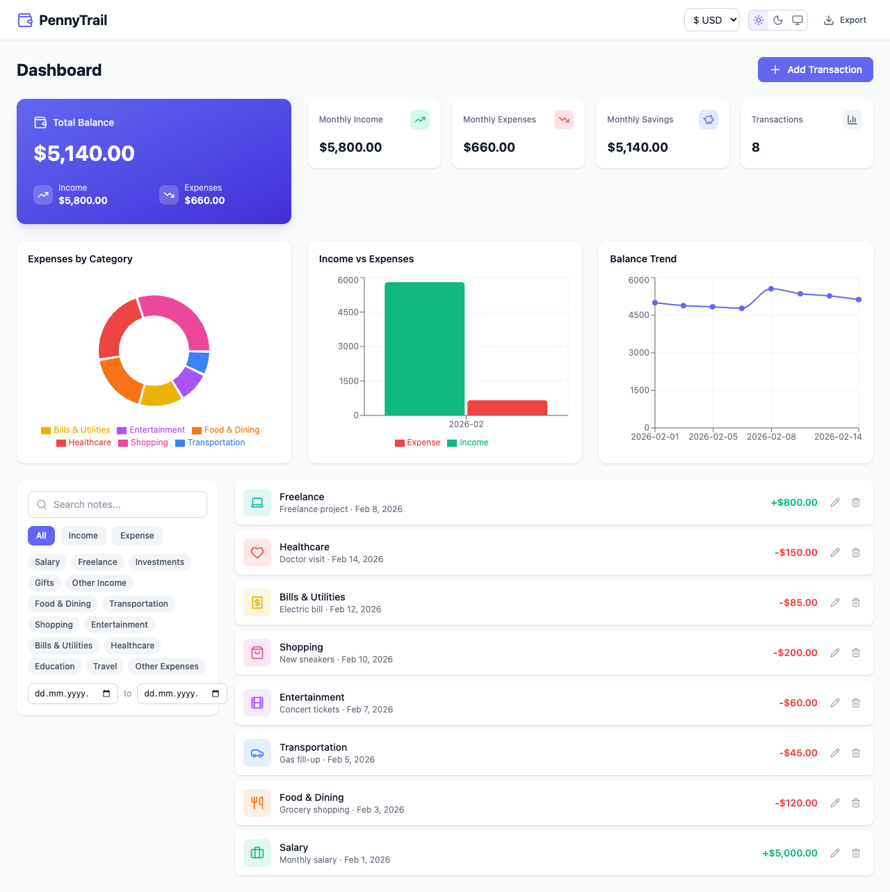

The main dashboard provides a complete financial overview at a glance. It includes a balance summary card, monthly metrics, three interactive charts, transaction filters, and a full transaction list — all on one page.

## Balance Card

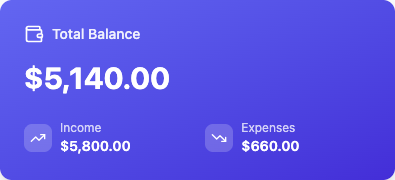

The hero card displays your total balance with a breakdown of total income and expenses. It uses a gradient background to visually distinguish it as the primary metric.

## Summary Cards

The monthly summary row shows four key metrics: monthly income, monthly expenses, monthly savings, and total transaction count. Each card has a color-coded icon for quick scanning.

## Adding Transactions

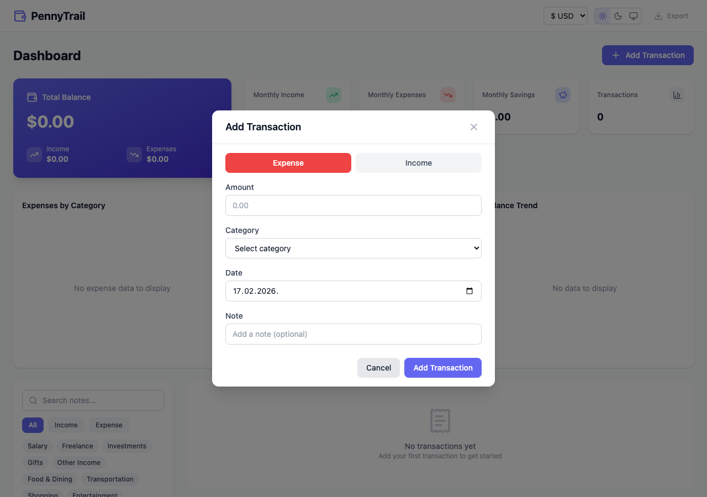

Click "Add Transaction" to open a modal form. Toggle between Expense and Income types, enter an amount, select a category, pick a date, and optionally add a note.

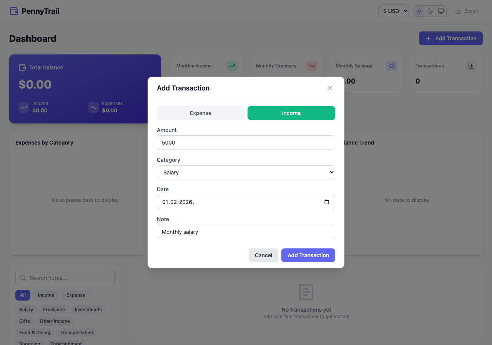

The form validates input with Zod — amounts must be positive numbers, a category is required, and dates must be in YYYY-MM-DD format. Category options automatically update when switching between income and expense types.

## Editing Transactions

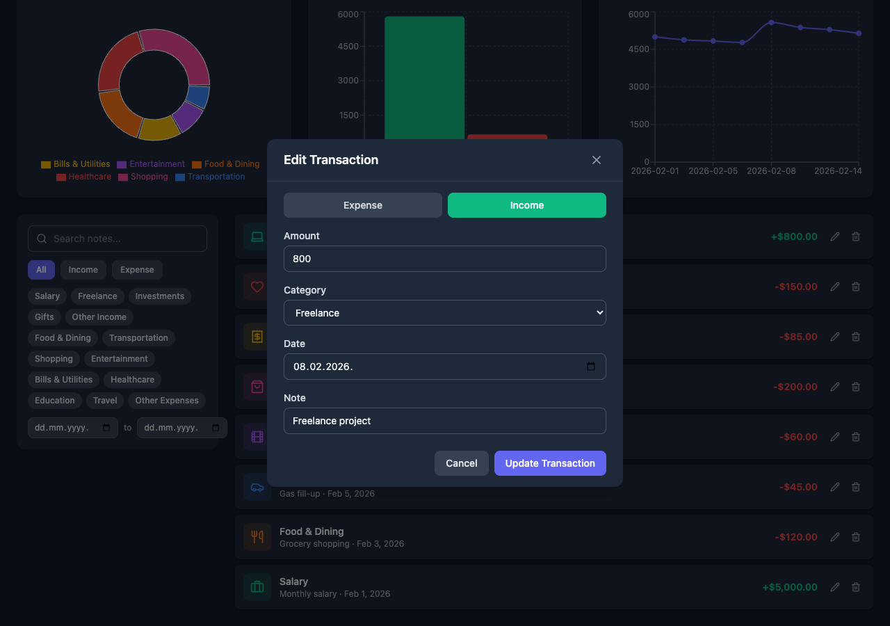

Click the pencil icon on any transaction to edit it. The modal pre-fills with the existing values. You can also delete transactions using the trash icon.

## Charts & Visualizations

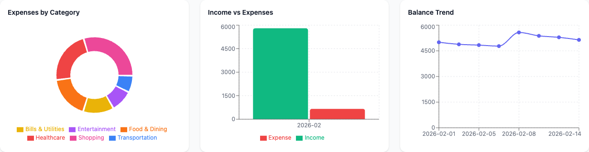

Three interactive Recharts-powered visualizations:

- **Expenses by Category** — Donut chart showing the distribution of spending across categories
- **Income vs Expenses** — Bar chart comparing monthly income and expense totals
- **Balance Trend** — Line chart tracking running balance over time

All charts include tooltips on hover and responsive sizing.

## Transaction List

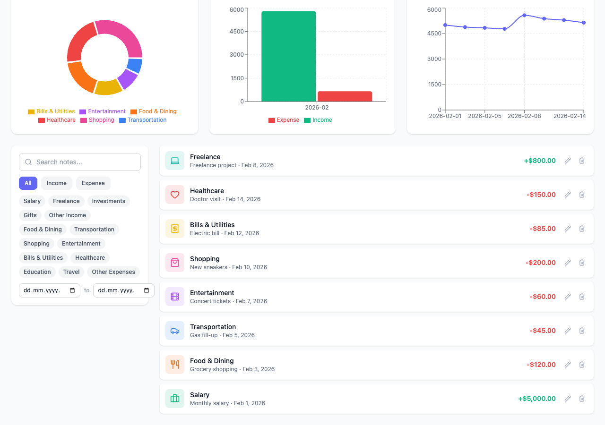

Transactions display in reverse chronological order with category icons, color-coded amounts (green for income, red for expenses), dates, and notes. Each row has edit and delete actions.

## Filtering & Search

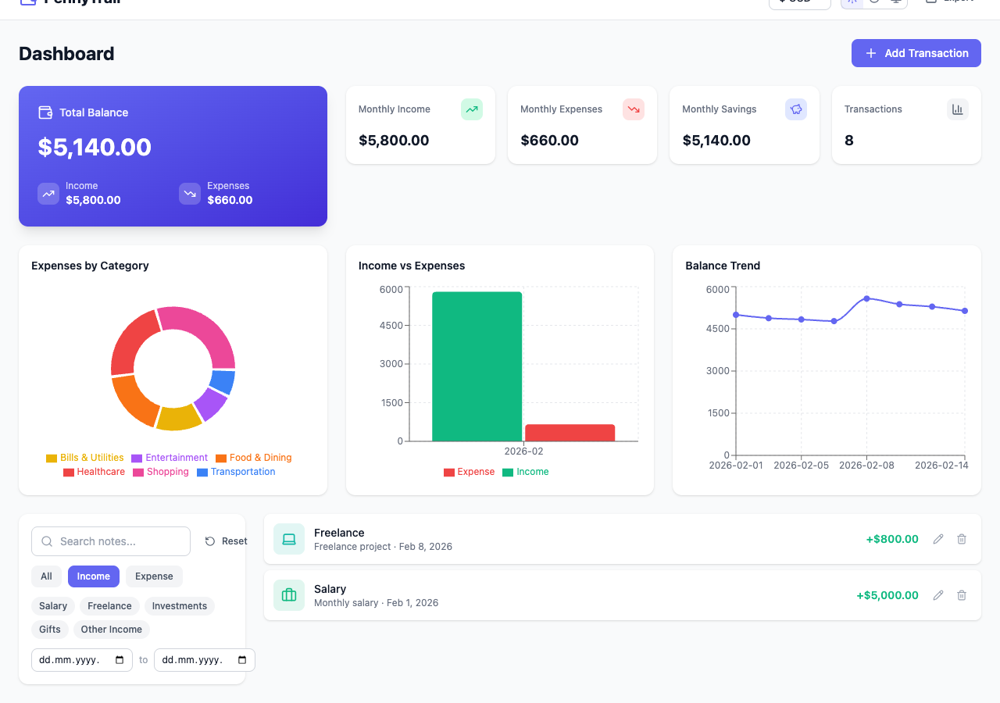

Filter transactions by type (All / Income / Expense) using toggle buttons. The transaction list updates instantly.

Additional filtering options include:
- **Search** — Debounced text search across transaction notes
- **Category pills** — Click to toggle one or more categories (multi-select)
- **Date range** — Filter to a specific date window
- **Reset** — Clear all active filters with one click

## Dark Mode

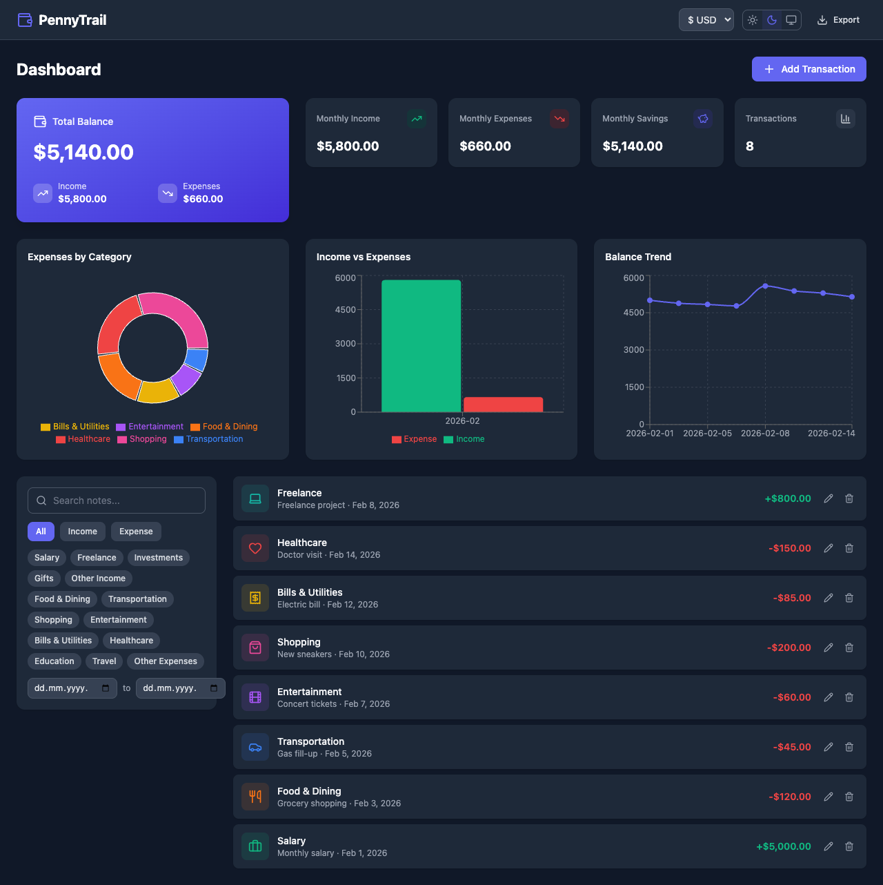

Toggle between Light, Dark, and System themes using the icons in the header. The entire UI adapts including backgrounds, text, borders, and card surfaces.

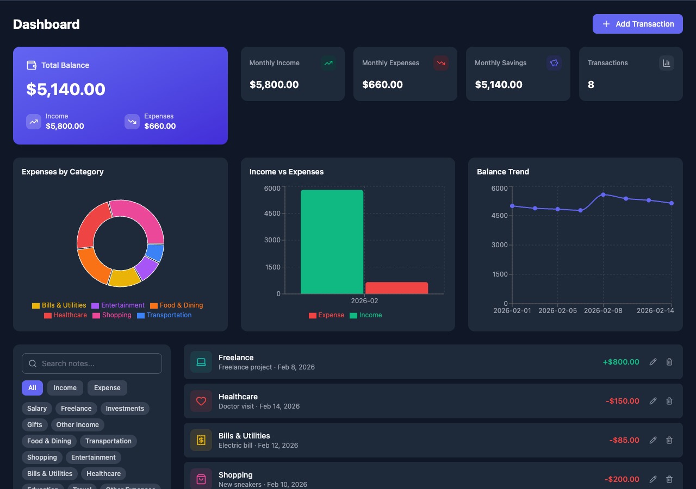

Charts also adapt to dark mode with adjusted axis colors, grid lines, and tooltip backgrounds for readability.

## Currency Selection

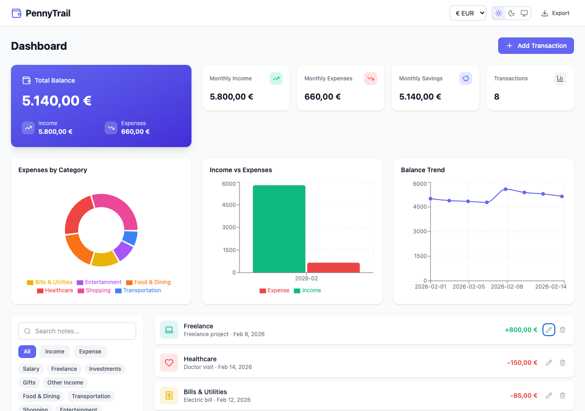

Switch between five currencies (USD, EUR, GBP, JPY, INR) using the dropdown in the header. All amounts across the dashboard re-format instantly using locale-aware `Intl.NumberFormat`.

## Responsive Design

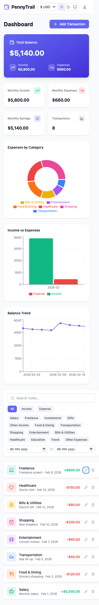

The layout adapts to mobile viewports. Charts stack vertically, the header condenses, and the transaction list remains fully usable on small screens.

## Empty State

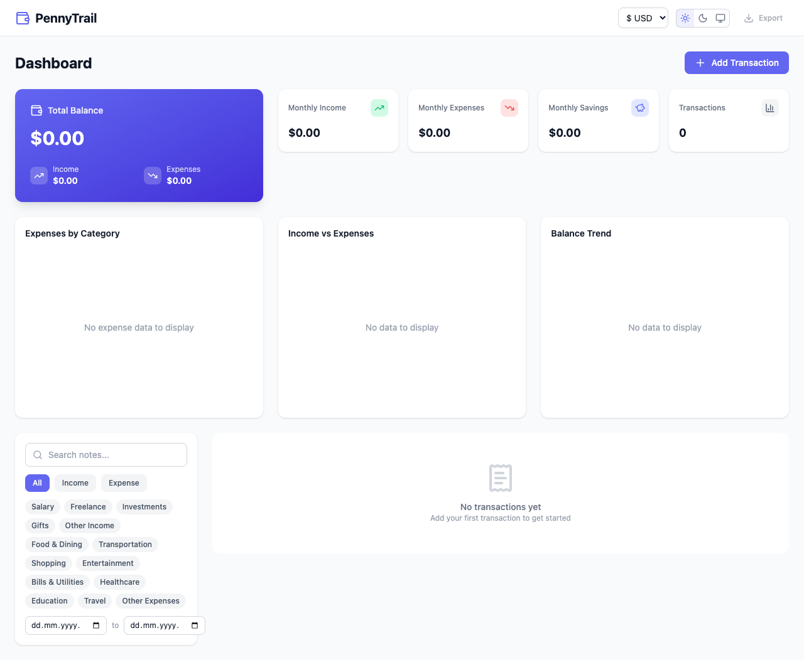

When no transactions exist, the dashboard shows zero-value metrics, empty chart placeholders, and a friendly prompt to add your first transaction.

## CSV Export

Click the Export button in the header to download all transactions as a CSV file. The file includes date, type, category, amount, and note columns with the current date in the filename.

---

## Data Persistence

All transaction data and user preferences are saved to `localStorage` via Zustand's `persist` middleware:

| Store | Key | What's Persisted |
|-------|-----|-----------------|
| Transactions | `pennytrail-transactions` | All transaction records |
| UI Settings | `pennytrail-ui` | Theme preference, selected currency |
| Filters | *(not persisted)* | Reset on page reload |

Data survives page reloads and browser restarts. Clear your browser's localStorage to reset.

## Keyboard Shortcuts

| Key | Action |
|-----|--------|
| `Escape` | Close any open modal |

## Tech Stack

| Technology | Purpose |
|-----------|---------|
| React 19 | UI framework |
| TypeScript | Type safety |
| Vite | Build tool & dev server |
| Tailwind CSS v4 | Styling |
| Zustand + Immer | State management |
| Zod | Form validation |
| Recharts | Charts & visualizations |
| date-fns | Date formatting |
| Lucide React | Icons |
